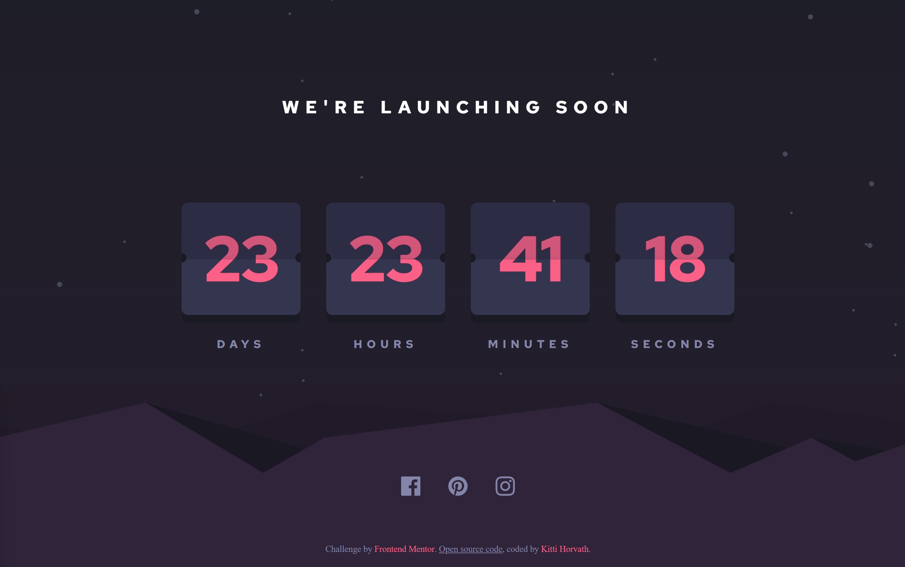

# Launch countdown timer

This is a solution to the Launch countdown timer challenge on Frontend Mentor. Frontend Mentor challenges help you improve your coding skills by building realistic projects.

### The challenge

Users should be able to:

- See hover states for all interactive elements on the page
- See a live countdown timer that ticks down every second (start the count at 14 days)

### Links

- [Solution URL]()
- [Live Site URL]()

## My process

### Built with

- HTML
- CSS
- JavaScript

## Author

- [Website](https://www.kittihorvath.com)
- Frontend Mentor - [@Horv-Kitty](https://www.frontendmentor.io/profile/Horv-Kitty)
